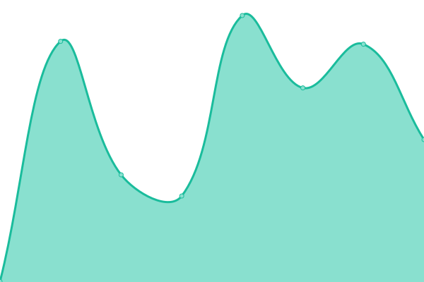

# [📈 Live Status](https://upptime-monitor.clouddefenseai.com): <!--live status--> **🟧 Partial outage**

This repository contains the open-source uptime monitor and status page for [CloudDefenseAI](https://upptime-monitor.clouddefenseai.com), powered by [Upptime](https://github.com/upptime/upptime).

With [Upptime](https://upptime.js.org), you can get your own unlimited and free uptime monitor and status page, powered entirely by a GitHub repository. We use [Issues](https://github.com/CloudDefenseAI/upptime-monitor/issues) as incident reports, [Actions](https://github.com/CloudDefenseAI/upptime-monitor/actions) as uptime monitors, and [Pages](https://upptime-monitor.clouddefenseai.com) for the status page.

<!--start: status pages-->
<!-- This summary is generated by Upptime (https://github.com/upptime/upptime) -->
<!-- Do not edit this manually, your changes will be overwritten -->
<!-- prettier-ignore -->
| URL | Status | History | Response Time | Uptime |
| --- | ------ | ------- | ------------- | ------ |
|  [CloudDefense.AI](https://www.clouddefense.ai) | 🟩 Up | [cloud-defense-ai.yml](https://github.com/CloudDefenseAI/upptime-monitor/commits/HEAD/history/cloud-defense-ai.yml) | 

 1046ms
     
 | 

<a href="https://upptime-monitor.clouddefenseai.com/history/cloud-defense-ai">100.00%</a>
    

|  [CloudDefense.AI DevSecOps Portal(US)](https://console.clouddefenseai.com) | 🟩 Up | [cloud-defense-ai-dev-sec-ops-portal-us.yml](https://github.com/CloudDefenseAI/upptime-monitor/commits/HEAD/history/cloud-defense-ai-dev-sec-ops-portal-us.yml) | 

 312ms
     
 | 

<a href="https://upptime-monitor.clouddefenseai.com/history/cloud-defense-ai-dev-sec-ops-portal-us">100.00%</a>
    

|  [CloudDefense.AI CloudSec Portal(US)](https://acs-us.clouddefenseai.com) | 🟩 Up | [cloud-defense-ai-cloud-sec-portal-us.yml](https://github.com/CloudDefenseAI/upptime-monitor/commits/HEAD/history/cloud-defense-ai-cloud-sec-portal-us.yml) | 

 307ms
     
 | 

<a href="https://upptime-monitor.clouddefenseai.com/history/cloud-defense-ai-cloud-sec-portal-us">100.00%</a>
    

|  [CloudDefense.AI DevSecOps Portal(IND)](https://console-ind.clouddefenseai.com) | 🟩 Up | [cloud-defense-ai-dev-sec-ops-portal-ind.yml](https://github.com/CloudDefenseAI/upptime-monitor/commits/HEAD/history/cloud-defense-ai-dev-sec-ops-portal-ind.yml) | 

 944ms
     
 | 

<a href="https://upptime-monitor.clouddefenseai.com/history/cloud-defense-ai-dev-sec-ops-portal-ind">100.00%</a>
    

|  [CloudDefense.AI DevSecOps Portal(UAE)](https://uae.clouddefenseai.com) | 🟩 Up | [cloud-defense-ai-dev-sec-ops-portal-uae.yml](https://github.com/CloudDefenseAI/upptime-monitor/commits/HEAD/history/cloud-defense-ai-dev-sec-ops-portal-uae.yml) | 

 1193ms
     
 | 

<a href="https://upptime-monitor.clouddefenseai.com/history/cloud-defense-ai-dev-sec-ops-portal-uae">100.00%</a>
    

|  [CloudDefense.AI CloudSec Portal(UAE)](https://acs-uae.clouddefenseai.com) | 🟩 Up | [cloud-defense-ai-cloud-sec-portal-uae.yml](https://github.com/CloudDefenseAI/upptime-monitor/commits/HEAD/history/cloud-defense-ai-cloud-sec-portal-uae.yml) | 

 1164ms
     
 | 

<a href="https://upptime-monitor.clouddefenseai.com/history/cloud-defense-ai-cloud-sec-portal-uae">100.00%</a>
    

|  [CloudDefense.AI DevSecOps Portal(QA)](https://qa.clouddefenseai.com) | 🟥 Down | [cloud-defense-ai-dev-sec-ops-portal-qa.yml](https://github.com/CloudDefenseAI/upptime-monitor/commits/HEAD/history/cloud-defense-ai-dev-sec-ops-portal-qa.yml) | 

 293ms
     
 | 

<a href="https://upptime-monitor.clouddefenseai.com/history/cloud-defense-ai-dev-sec-ops-portal-qa">100.00%</a>
    

|  [CloudDefense.AI CloudSec Portal(QA)](https://acs-qa.clouddefenseai.com) | 🟩 Up | [cloud-defense-ai-cloud-sec-portal-qa.yml](https://github.com/CloudDefenseAI/upptime-monitor/commits/HEAD/history/cloud-defense-ai-cloud-sec-portal-qa.yml) | 

 292ms
     
 | 

<a href="https://upptime-monitor.clouddefenseai.com/history/cloud-defense-ai-cloud-sec-portal-qa">100.00%</a>
    

|  [CloudDefense.AI DevSecOps Portal(DEV)](https://dev.clouddefenseai.com) | 🟩 Up | [cloud-defense-ai-dev-sec-ops-portal-dev.yml](https://github.com/CloudDefenseAI/upptime-monitor/commits/HEAD/history/cloud-defense-ai-dev-sec-ops-portal-dev.yml) | 

 150ms
     
 | 

<a href="https://upptime-monitor.clouddefenseai.com/history/cloud-defense-ai-dev-sec-ops-portal-dev">100.00%</a>
    

|  [CloudDefense.AI CloudSec Portal(DEV)](https://acs-dev.clouddefenseai.com) | 🟩 Up | [cloud-defense-ai-cloud-sec-portal-dev.yml](https://github.com/CloudDefenseAI/upptime-monitor/commits/HEAD/history/cloud-defense-ai-cloud-sec-portal-dev.yml) | 

 162ms
     
 | 

<a href="https://upptime-monitor.clouddefenseai.com/history/cloud-defense-ai-cloud-sec-portal-dev">100.00%</a>
    

<!--end: status pages-->

[**Visit our status website →**](https://upptime-monitor.clouddefenseai.com)

## 📄 License

- Powered by: [Upptime](https://github.com/upptime/upptime)
- Code: [MIT](./LICENSE) © [Anand Chowdhary](https://anandchowdhary.com), supported by [Pabio](https://pabio.com)
- Data in the `./history` directory: [Open Database License](https://opendatacommons.org/licenses/odbl/1-0/)
